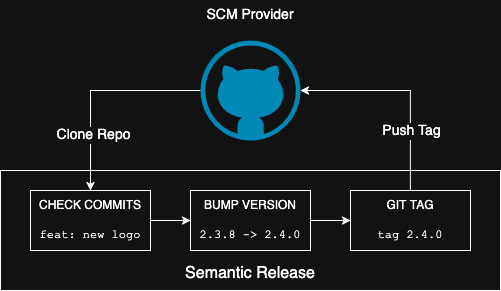

# semver-plugin

Semantic versioning in the pipeline.

semver-plugin is tool to abstract semantic-release in a Harness pipeline.

- [About Semantic Release](#about-semantic-release)
- [About this Plugin](#about-this-plugin)
- [Variables](#variables)
- [Harness Pipeline Usage](#harness-pipeline-usage)
- [Outputs](#outputs)
- [Repo Configuration](#repo-configuration)

## About Semantic Release

This tool uses commit messages to detect and trigger version changes using [semantic versioning](https://semver.org/) (1.2.3).



### Semantic Versioning

Sem Ver uses a three part version number (e.g., `1.0.0`) to increment version numbers. Each part refers to the major, minor, a patch version respectively.

### Conventional Commits

Semantic release uses [Conventional Commits](https://www.conventionalcommits.org/en/v1.0.0/), meaning prefixes like `fix:` in commit messages are used o detect when to bump the version.

```bash
# Update patch versions (x.x.1)
fix: updated alignment issue with profile icon
# Update minor versions (x.1.x)
feat: add new payment provider
# Update major versions (1.x.x)
BREAKING CHANGE: migrating to API version 2
```

### Git Tagging

In addition to generating a new version number, this tool also tags the git commit and pushes the tag to a SCM provider.

This tag is then used on the next run to determine the prior version number.

## About this Plugin

This plugin abstracts the semantic release package and provides all the necessary dependencies without adding them to the code repository.

- Abstraction: get semantic versioning your app without the complexity
- Designed for CI: add to your pipeline with minimal configuration
- Built-in dependencies: all the required libraries to run semver are baked into the image
- Outputs:

### Docker Image

This plugin is intended to be used in a CI pipeline that supports containerized builds. It uses a `node` base image and contains

#### ENTRYPOINT

This plugin is designed with needing to be provided any commands (notwithstanding any environment variables).

If the entrypoint is overridden, the main script can be invoked at `/opt/winc/semver/scripts/main.sh`.

## Variables

Parameters are supplied to semver-plugin through environment variables.

The most important variable is the git token/credentials. Most of the semantic release variables can also be provided through a configuration file.

### Git Tokens

One (and only one) of the following token variables can be set: `GITHUB_TOKEN`, `GITLAB_TOKEN`, `BITBUCKET_TOKEN`, `GIT_CREDENTIALS`, or `HARNESS_TOKEN`. If none of the variables are set or multiple are set, the script will fail and exit.

**Use Secrets**:

Use the expression `<+secrets.getValue("secret_name")>` to reference a secret in Harness.

### Authentication Variable List

> **1️⃣ CHOOSE ONE** \
> Only one authentication variable should be set.

| Variable           | Set to                                                                           |
| ------------------ | -------------------------------------------------------------------------------- |
| `HARNESS_TOKEN`    | Harness PAT or SAT.                                                              |
| `HARNESS_USERNAME` | Harness username. This is required when `HARNESS_TOKEN` is set.                  |
| `GIT_CREDENTIALS`  | Generic git credentials (`USERNAME:PASSWORD`). URL encode each value separately. |
| `GITHUB_TOKEN`     | GitHub PAT credentials.                                                          |
| `GITLAB_TOKEN`     | GitLab PAT credentials.                                                          |
| `BITBUCKET_TOKEN`  | BitBucket PAT credentials.                                                       |

### Committer Variable List

| Variable              | Set to                                          |
| --------------------- | ----------------------------------------------- |
| `GIT_AUTHOR_NAME`     | Author of name associated with git release tag  |
| `GIT_AUTHOR_EMAIL`    | Author of email associated with git release tag |
| `GIT_COMMITTER_NAME`  | Committer name associated with git release tag  |
| `GIT_COMMITTER_EMAIL` | Committer email associated with git release tag |

### Semantic Release Variable List

| Variable       | Set to                                        |
| -------------- | --------------------------------------------- |
| `DRY_RUN`      | Use dry run mode (do not release new version) |
| `DEBUG_SEMVER` | Use dry run mode (do not release new version) |

### Variable Descriptions

#### `HARNESS_TOKEN`

This is a Harness PAT or SAT Token.

- **SET TO**: Unencoded Harness PAT or SAT. The script will URL encode the values for you.
- Use when Harness Code is the SCM Provider. This can also be used for a generic git token.
- If this is provided, no other `_TOKEN` or `GITHUB_CREDENTIALS` variable should be set

#### `HARNESS_USERNAME`

The Harness username for the user or service account.

- **SET TO**: Unencoded Harness username.
- Use when Harness Code is the SCM Provider. This can also be used for a generic git username.
- If `HARNESS_TOKEN` is used, this variable **must** be set.

#### `GIT_CREDENTIALS`

Generic git credentials provided in the format `USERNAME:PASSWORD`.

- **SET TO**: a partially URL encoded string (`<url_encoded_username>:<url_encoded_password>`).
  - The username and password should each individually be URL encoded, meaning the `:` separating the two is **not** URL encoded.
  - The script will **not** make the URL encoding for you.
- If this is provided, no other `_TOKEN` variable should be set

#### `GITHUB_TOKEN`, `GITLAB_TOKEN`, `BITBUCKET_TOKEN`

This is a PAT token for the specific SCM provider.

- **SET TO**: GitHub, GitLab, or BitBucket PAT (not URL encoded).
- If this is provided, no other `_TOKEN` or `GITHUB_CREDENTIALS` variable should be set

### Optional Variables

#### `REPO_DIR`

Change into a non-default directory where the code repo is located.

- **SET TO**: a `string` that points to the repo's directory
- **DEFAULT**: working directory
- The default working directory of this image is `/opt/winc/semver`. CI tools like Harness will automatically change the working directory to the same location the code is located (making this setting unnecessary).
- If Harness is the CI tool, this variable is not required, assuming the repo is cloned into the default location (i.e., `/harness`).

#### `DRY_RUN`

Run semantic release in dry run mode: detect version changes, but do not bump version or push git tags.

- **SET TO**: `true` to enable dry run mode
- **DEFAULT**: `false`
- Previous commits will be analyzed and a new version (if any) will be computed, but no tag will be pushed to the SCM provider.

#### `SKIP_CI`

Disable semantic release CI environment verification checks. Use for making releases locally.

- **SET TO**: `true` to skip CI checks
- **DEFAULT**: `false`
- Semantic release will prevent new releases if it detects it's running outside a CI pipeline.

#### `REPOSITORY_URL`

Provide a repository URL to semantic release if it cannot be detected automatically.

- **SET TO**: a `string` equal to a valid URL for the repository

#### `TAG_FORMAT`

Provide a repository URL to semantic release if it cannot be detected automatically.

- **SET TO**: a `string` equal to the git tag format that will be used to identify existing releases
- **DEFAULT**: `v${version}`
- Semantic release check the `package.json` file and the `git origin` URL.
- If this plugin is run inside a git directory with an origin set, the repository URL will automatically be detected.

#### `SEMREL_PLUGINS`

Array of NPM plugins to provide to semantic release.

- **SET TO**: a `array` of plugins for semantic release to use.
- **DEFAULT**: `['@semantic-release/commit-analyzer', '@semantic-release/release-notes-generator', '@semantic-release/npm', '@semantic-release/github']`
- This can alternately be defined in the repository using some type of `release.config.js` file.

### Plugin Variables

This plugin is intended to be used as a Harness Plugin step. If it's run in any other step type, or in another build tool (not Harness), modify the environment variables for compatibility.

> **⚠️ ATTENTION** \
> Prefix variables with `PLUGIN_` when **not** using a Harness Plugin step.

If a Harness Plugin step is used, use the variable names as normal.

If a Harness Run step, or another build tool is used, prefix the variable names with `PLUGIN_`. For example the variable `REPO_URL` becomes `PLUGIN_REPO_URL`.

## Preflight Check

- Format variables
- Target correct repo

## Harness Pipeline Usage

Add this plugin as a step in the Harness pipeline.

### As a Plugin Step

Use a Plugin step in Harness to maximize simplicity.

- No commands needed. The logic is baked into the container.
- Automatically populates output variables (that can be used in later steps)

```bash
              - step:
                  type: Plugin
                  name: semantic version
                  identifier: semantic_version
                  spec:
                    connectorRef: account.MY_CONNECTOR
                    image: wyattmunson/semver-plugin:1.1.3
                    settings:
                      HARNESS_TOKEN: <+secrets.getValue("MY_TOKEN")>
                      HARNESS_USERNAME: MY_USERNAME@example.com
```

```
<+execution.steps.sem_ver_run_step.output.outputVariables.NEXT_VERSION>
<+pipeline.stages.build.spec.execution.steps.sem_ver_run_step.output.outputVariables.NEXT_VERSION>
```

- `NEXT_VERSION`
- `EXISTING_VERSION`
- `VERSION_STATUS`

### As a Run Step

Use a Run step in Harness to capture the output variables.

- Prefix environment variables with `PLUGIN_` (e.g., `PLUGIN_HARNESS_TOKEN`).
- Harness overrides the entrypoint, meaning the script must be invoked in the `command` block. Do not modify this command.
- Update your Docker connector git username and password.

```
              - step:
                  type: Run
                  name: run_semver
                  identifier: run_semver
                  spec:
                    connectorRef: account.MY_DOCKER_CONNECTOR
                    image: wyattmunson/semver-plugin:1.0.23
                    shell: Bash
                    command: |-
                      eval "$("/opt/winc/semver/scripts/main.sh" | tee /dev/stderr | grep '^export ')"
                    envVariables:
                      PLUGIN_HARNESS_TOKEN: <+secrets.getValue("MY_PAT")>
                      PLUGIN_HARNESS_USERNAME: "MY_USERNAME"
                    outputVariables:
                      - name: NEXT_VERSION
                        type: String
                        value: NEXT_VERSION
                      - name: VERSION_STATUS
                        type: String
                        value: VERSION_STATUS
                      - name: EXISTING_VERSION
                        type: String
                        value: EXISTING_VERSION
```

## Outputs

In addition to running semantic release, this plugin captures and exports several variables.

| Variable           | Use                                                   |
| ------------------ | ----------------------------------------------------- |
| `EXISTING_VERSION` | Prior version, if any, before changes are considered. |
| `NEXT_VERSION`     | Next version, if any (e.g., `3.4.0`).                 |

### File

An output file (`.next-version.yaml`) with the value of `NEXT_VERSION` is created by this plugin. It is created in the working directly of the container.

In Harness, this file is available at `/harness/.next-version.yaml`.

### Output Variables

#### `NEXT_VERSION`

If semrel detects a version change, this will be set to the new version number, e.g., `1.4.0`. This is populated on the first version and every version upgrade. It is null when no version changes are detected.

#### `EXISTING_VERSION`

If semrel detects an existing or prior version number, this will be set to that version number , e.g., `1.3.26`. This is populated when a prior version number is found (even if the version doesn't change). It is null when no prior version number exists.

#### `VERSION_STATUS`

Outputs a short string describing the status of the version check.

- Three output states
  - `Upgraded version` - the version was changed and a previous version was detected. The version number will be upgraded.
  - `First run (no previous version)` - a version change was detected, but no prior version was found. The first version number will be created.
  - `No changes detected` - no version change was detected, or an unexpected error occurred
- This can be used in subsequent steps to determine whether to run a command or some other logic.

## Repo Configuration

Make these changes in you codebase to add semantic versioning to you code repository.

> Your repo does not need to use Node.js

There are multiple ways to setup a repo for semantic release, but the simplest is to add a `.releaserc` file.

### Create `.releaserc` File

Create a `.releaserc` file in the root of your repository. To get started, use the sample configuration below:

```json
{
  "branches": ["master", "main"],
  "plugins": [
    "@semantic-release/commit-analyzer",
    "@semantic-release/release-notes-generator",
    "@semantic-release/changelog",
    [
      "@semantic-release/git",
      {
        "assets": ["package.json", "CHANGELOG.md"],
        "message": "chore(release): ${nextRelease.version} [skip ci]\n\n${nextRelease.notes}"
      }
    ]
  ]
}
```

- No additional configuration is needed to the repository beyond adding the above file.
- No requirements to add a `package.json` file or install npm dependencies.
